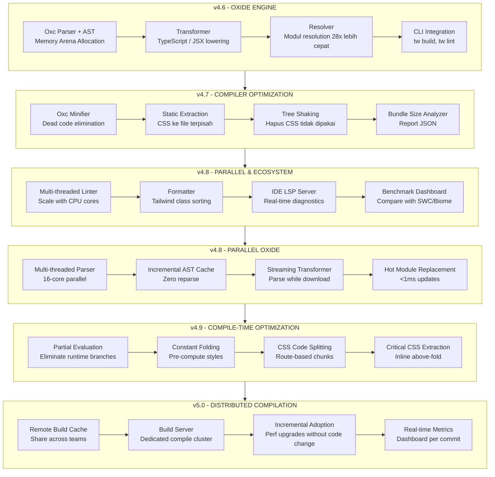
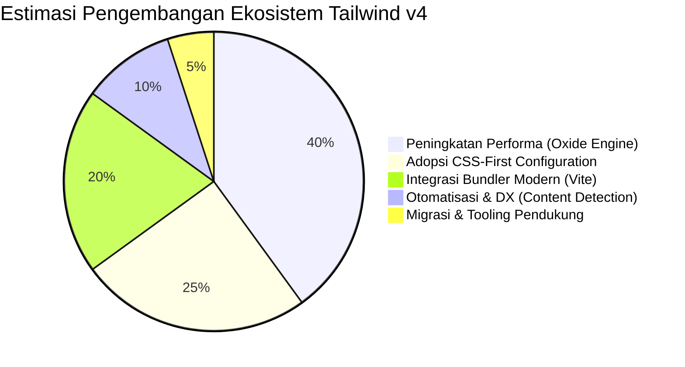

# Visual Arsitektur Awal (Kickoff)

Dokumen ini adalah titik mulai (“mulai pembuatan”) untuk memetakan arsitektur dan roadmap `tailwind-styled-v4` berdasarkan diagram awal.

## 1) Roadmap Evolusi v4.6 → v5.0



## 2) Lifecycle Hooks Pipeline

```mermaid
flowchart TB
  subgraph SCAN[scan()]
    S1[beforeScan hooks] --> S2[Proses scanning] --> S3[afterScan hooks]
  end

  subgraph BUILD[build()/watch()]
    B1[beforeBuild hooks] --> B2[transformClasses hooks] --> B3[Proses build] --> B4[afterBuild hooks]
  end

  subgraph ERR[watcher error]
    E1[onError hooks]
  end
```

## 3) Layer Arsitektur Engine

```mermaid
flowchart TB
  I[Input\nFile Proyek: tsx, jsx, vue, svelte, mdx, html] --> L1

  subgraph L1[Layer 1: Scanner]
    L1A[fast-glob/tinyglobby] --> L1B[AST Parser\n@babel/parser] --> L1C[Extract Classes] --> L1D[Cache .cache/tailwind-styled]
  end

  L1D --> L2

  subgraph L2[Layer 2: Parser]
    L2A[Parse Class Structure] --> L2B[Variant Detector\nhover:, focus:, dark:] --> L2C[Modifier Parser\n/50, (--var)] --> L2D[Utility Normalizer]
  end

  L2D --> L3

  subgraph L3[Layer 3: Engine]
    L3A[Merge & Dedupe] --> L3B[Pattern Detector] --> L3C[Optimize Ordering] --> L3D[Incremental Builder]
  end

  L3D --> L4

  subgraph L4[Layer 4: Compiler]
    L4A[Static CSS Generator] --> L4B[Hash Generator\nnanoid] --> L4C[CSS File Writer] --> L4D[Source Maps]
  end

  L4D --> L5

  subgraph L5[Layer 5: Bundler]
    L5A[Vite Plugin] --> L5B[Rspack Plugin] --> L5C[Next.js Plugin]
  end

  L5C --> L6

  subgraph L6[Layer 6: Framework]
    L6A[React Adapter] --> L6B[Vue Adapter] --> L6C[Svelte Adapter]
  end

  L6C --> O

  subgraph O[Output]
    O1[Komponen dengan class hash]
    O2[CSS Final: kecil & cepat]
    O3[Bundle JS minimal]
    O2 --> O3
  end
```

## 4) Dependency Map Monorepo (Ringkas)

```mermaid
flowchart LR
  subgraph ROOT[Root Dev Tools]
    R1[Biome] --> R2[Lint]
    R3[oxlint] --> R4[RustLint]
    R5[tsup] --> R6[Build]
    R7[TypeScript] --> R8[TypeCheck]
  end

  subgraph VITE[packages/vite]
    V1[@tailwind-styled/compiler]
    V2[@tailwind-styled/engine]
    V3[@tailwind-styled/scanner]
    V4[vite - peer]
  end

  subgraph CLI[packages/cli]
    C1[@tailwind-styled/scanner] --> C2[ScanFiles]
    C3[readline/promises] --> C4[Wizard]
  end

  subgraph ENG[packages/engine]
    E1[@tailwind-styled/compiler]
    E2[@tailwind-styled/scanner]
  end

  subgraph SCN[packages/scanner]
    S1[@tailwind-styled/compiler]
    S2[Node fs/path] --> S3[Traversal]
  end

  subgraph CORE[packages/core]
    K1[postcss] --> K2[ProcessCSS]
    K3[tailwind-merge] --> K4[MergeClasses]
    K5[React - peer] --> K6[UI]
  end

  V1 --> CORE
  V2 --> ENG
  V3 --> SCN
  CLI --> SCN
  ENG --> CORE
  SCN --> CORE
```

## 5) Estimasi Pengembangan



## Catatan Eksekusi

- Diagram ini sengaja dibuat **incremental** agar bisa langsung dipakai untuk diskusi sprint.
- Detail implementasi tiap node mengikuti dokumen backlog existing (`v4.1`, `v4.2`, `v4.6-4.8`, `v4.8-5.0`).
- Jika diperlukan, tahap berikutnya adalah memecah setiap layer menjadi issue teknis per package.
